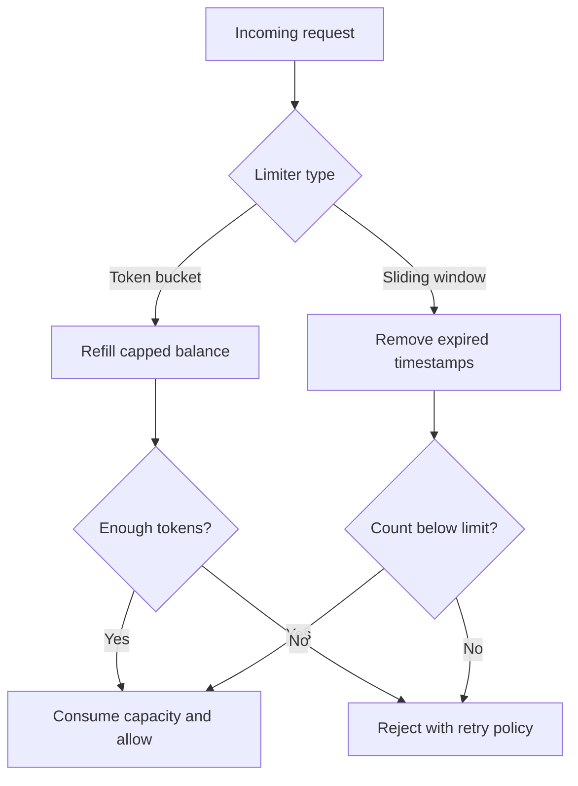
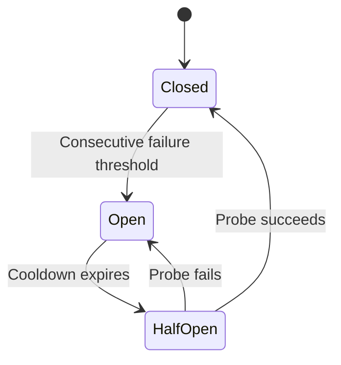

# Practical AI Coding — 20 Complete Walkthroughs

Companion to the [master answer sheet](ai_roles_high_frequency_master_sheet.md). All implementations are in [ai_roles_practical_solutions.py](ai_roles_practical_solutions.py), with executable checks in [test_ai_roles_practical_solutions.py](test_ai_roles_practical_solutions.py).

Run in this directory with Python 3.10+:

```powershell
python ai_roles_practical_solutions.py
python -m unittest -v test_ai_roles_practical_solutions.py
```

The code uses only the standard library. These are reference implementations for explaining and practicing the algorithms; each section states the additional work needed for production. Identifiers such as tenant and user are assumed to come from an authenticated application boundary, not arbitrary client input. Inputs must satisfy the annotated types; explicit validation focuses on semantic boundary conditions.

## 1. Implement an LRU cache

**Contract:** `LRUCache(capacity)` supports `put(key, value)` and `get(key)`. Capacity is positive; keys are hashable; a missing key raises `KeyError`, so `None` remains a valid cached value. Updating or reading an entry makes it most recently used.

**Algorithm:** Keep a hash map plus an ordered doubly linked list. Python's `OrderedDict` provides the required operations. Look up by key, move to the newest end, and evict from the oldest end if capacity is exceeded. In C++, the equivalent is `unordered_map<Key, list<pair<Key, Value>>::iterator>` plus `std::list`.

**Trace:** Capacity two: `put(A,1)`, `put(B,2)` gives `[A,B]`; `get(A)` gives `[B,A]`; `put(C,3)` evicts B and yields `[A,C]`.

**Correctness invariant:** Every cached key appears exactly once in recency order, and that order matches successful accesses/updates. Evicting its oldest element therefore removes the least recently used entry.

**State/concurrency:** In-memory, bounded by entry count. A lock makes each operation atomic within one process. Returned mutable values are shared references; the lock does not make later mutations of those values safe.

**Failures/security:** Do not retry a miss as though it were a service error. Add size limits if one entry can be huge, and scope keys by tenant/permissions. A cache stampede needs a separate single-flight loader policy.

**Complexity/tests:** Expected O(1) get/put, O(capacity) entries. Test eviction after a read, overwrites, missing keys, and cached `None`. Monitor hit rate, eviction rate, and bytes retained.

## 2. Implement a TTL cache

**Contract:** `put(key, value, ttl)` sets a positive finite lifetime from insertion/update; `get` returns only a live value. An entry is expired when `now >= expiry`. TTL is not extended by reads. A positive capacity bounds entry count.

**Algorithm:** Store `(value, deadline)` using a monotonic clock. A read checks the deadline and deletes an expired entry. A write removes expired entries before applying an LRU-style capacity limit. Clock injection makes tests deterministic.

**Trace:** At time 10, write A with TTL five. A is valid at 14.999 and expired at 15. Updating A at 12 with TTL ten moves its expiry to 22.

**Correctness invariant:** Every returned value has a deadline strictly later than the read's sampled time. A stale record may physically remain until accessed or a write scans it, but it is never returned by `get`.

**State/concurrency:** A lock protects each operation. This example scans all stored entries on writes; a min-heap of expirations plus generation numbers scales better for large caches. Old heap entries must not delete newer versions of the same key.

**Failure/security:** Monotonic deadlines cannot be persisted as portable wall-clock timestamps. TTL bounds staleness but is not a reliable permission-revocation mechanism; invalidate on ACL changes where needed.

**Complexity/tests:** Get O(1) expected; put O(C) for a full expiry scan; space O(C). Test exact expiry, overwrite, capacity, invalid TTL, and cleanup. Monitor stale misses, hits, and memory.

## 3. Implement a token-bucket rate limiter

**Contract:** One `TokenBucket(capacity, rate)` instance limits one authenticated scope. `allow(cost)` consumes a positive cost no larger than capacity or returns false. Rate is tokens per second; the bucket starts full.

**Algorithm:** At time t, refill `tokens = min(capacity, tokens + elapsed * rate)`. Admit only when enough tokens remain, then subtract cost. Use a monotonic clock and one lock around refill/check/subtract.

**Trace:** Capacity three, rate two/second: three immediate unit requests pass; the fourth fails. After half a second, one token returns and one more request passes. Idle time never increases the balance beyond three.

**Correctness invariant:** Token balance remains between zero and capacity. Over a duration T, admitted work cannot exceed initial tokens plus `rate*T`, subject to elapsed-time precision.

**State/concurrency:** Constant state for each limiter, single-process atomicity. A multi-server limiter needs a shared atomic operation or deliberately allocated per-server quotas. Independently full buckets on ten servers multiply the permitted burst.

**Failure/security:** Decide whether denied attempts consume quota; here they do not. Prevent attackers creating unbounded per-identity limiter objects and evict idle scopes. Distributed backend failure requires an explicit fail-open/closed policy.

**Complexity/tests:** O(1) time/space per scope. Test immediate burst, fractional refill, capacity cap, and invalid cost. Monitor allowed/denied cost and fairness by tenant.

## 4. Implement a sliding-window rate limiter

**Contract:** At most `limit` accepted requests in `(now-window, now]`. A request exactly one window old has expired. Denied requests are not recorded.

**Algorithm:** Maintain timestamps in a deque. Remove expired timestamps from the front; reject if the deque still contains `limit` entries; otherwise append now. Monotonic time preserves timestamp order.

**Trace:** Limit two, window ten: requests at times zero and one pass; at nine another fails. At ten, the time-zero request has expired, so one request can pass.

**Correctness invariant:** Before admission the deque contains exactly the accepted requests still in the window. Appending only when its size is below the limit preserves the contract.

**Trade-off:** A fixed-window counter needs less state but can allow a double burst around a window boundary. This exact rolling log avoids that at the cost of retaining accepted timestamps. Approximate bucketed counters reduce memory with defined approximation error.

**State/failure/security:** Locked per instance, not globally coordinated. Bound the number of identities; do not key solely on a spoofable header. For distributed use, atomically remove/count/add in shared storage.

**Complexity/tests:** Amortized O(1) per request because each timestamp is appended/removed once; O(limit) memory. Test the exact boundary, denial, and repeated timestamps. Monitor rejection rates and per-scope memory.



## 5. Implement an idempotent event processor

**Contract:** `process(tenant, event_id, {"name": ...})` creates one local record and returns its ID. Repeating the same tenant/event/payload returns the original result. Reusing a key with a different payload raises a conflict. The accepted payload schema is deliberately narrow.

**Algorithm:** Canonicalize JSON and hash it. Start `BEGIN IMMEDIATE`, check the composite key, perform the record insertion if new, store the response, and commit. All changes share the same SQLite transaction. Parameterized queries prevent string interpolation into SQL.

**Correctness argument:** A transaction commits the mutation and deduplication record together or neither. SQLite serializes writers; a competing transaction sees the committed key before creating another effect. The composite primary key is a second uniqueness barrier. After a lost response, a replay reads the committed response.

**State/concurrency:** Persistent in the supplied database file; tests use temporary files. Each connection is owned by its creating thread. Use separate connections for independent workers. Contention may produce a busy/locked error after the timeout; retry the whole operation with the same key, within a bounded policy.

**Boundary:** This does not make a remote API exactly-once. For external effects, commit an outbox event with the local mutation and have a worker send it using a receiver-supported idempotency key. Define retention: forgetting old keys allows old replays to act again.

**Security:** Authenticate tenant upstream, restrict database-file permissions, avoid logging raw payloads, and validate the business entity separately. An event key prevents the same event from repeating; it does not detect two different event IDs referring to the same real customer.

**Complexity/tests:** Indexed key access O(log E) for E events, payload serialization/hash O(P), persistent space grows with records/events. Test replay after reopening, conflicting payloads, tenant scope, rollback, and competing connections. Monitor duplicate hits, conflicts, busy errors, and unresolved external effects.

## 6. Implement a bounded worker queue

**Contract:** `await run_bounded(items, async_worker, workers, max_pending)` returns ordered `(success, result_or_exception)` pairs. Ordinary worker exceptions are collected; they do not silently kill the pool. The input is finite and nonblocking to iterate.

**Algorithm:** Start a fixed number of consumer tasks. Producer `await queue.put(...)` blocks when pending capacity is full, applying backpressure. Workers process one item at a time. Sentinels end workers after queued jobs. A `finally` block cancels and awaits outstanding consumers when the caller cancels or production fails.

**Correctness:** FIFO queue admission gives each item one worker in this process. Store results by input index to reconstruct input order even when completion order differs. This is not crash-safe delivery: an interrupted process loses its queue and results.

**State/concurrency:** At most `workers` active calls and `max_pending` queued jobs, but all returned results are retained: total output memory is O(N). For genuinely bounded total memory, stream results to a consumer or durable sink. Worker functions should propagate caller cancellation and not use cancellation as a business error.

**Failure/security:** Apply timeouts inside workers, do not block the event loop with CPU-heavy synchronous work, and retry only idempotent tasks. Use payload limits and per-tenant fairness for shared queues.

**Complexity/tests:** O(N) scheduling overhead plus worker work; buffered state O(max_pending + workers + N results). Test concurrency ceiling, ordering, a failed item, invalid limits, producer exceptions, and caller cancellation cleanup. Monitor queue age, processing time, active workers, and failure count.

## 7. Implement retry with backoff and jitter

**Contract:** `retry(operation, attempts, base, cap, retry_on)` returns the first success or raises the last eligible failure. Attempts includes the initial call. Only declared transient exception classes are retried; other exceptions propagate immediately.

**Algorithm:** After eligible failure i, wait a random duration uniformly sampled from `[0, min(cap, base * 2^i)]`. The implementation grows a capped delay iteratively to avoid constructing enormous powers. Do not sleep after the final failure.

**Example:** Base 0.1 seconds and cap one second produce maximum waits 0.1, 0.2, 0.4, 0.8, one, one. Full jitter spreads clients across those intervals rather than aligning every client on the same retry times.

**Correctness:** The loop performs at most `attempts` calls. A success returns immediately, and a terminal/nonretryable error cannot cause another attempt.

**State/concurrency:** No shared state. Clock-independent tests inject a fake sleep and deterministic random source. The implementation does not interrupt a hung operation or impose an overall deadline; the caller must set per-call deadlines and bound total elapsed time. Production clients should also handle valid server retry hints.

**Security/failure:** Retry GET-like operations or writes with durable idempotency. Retrying an uncertain payment without such a key can duplicate charges. Avoid retry multiplication across client, proxy, and service layers.

**Complexity/tests:** O(A) attempts, O(1) state, plus operation duration and sleep. Test eventual success, terminal error, exhausted attempts, delay cap, and no sleep after final failure. Monitor retry amplification and recovered versus wasted attempts.

## 8. Implement a circuit breaker

**Contract:** `call(operation)` tracks consecutive dependency failures. At a threshold it opens; calls during cooldown raise `CircuitOpen` without executing the operation. After cooldown, the next sequential call is a half-open probe.

**State transitions:** Closed success resets the count. Closed failure increments it. Threshold failure opens the circuit. A successful half-open probe closes it; a failed probe restarts cooldown. Declared dependency errors affect health; business/validation errors propagate and clear this simple consecutive-failure state.



**Why it helps:** Failing fast protects a struggling dependency and frees caller capacity. It does not fix the dependency and is distinct from rate limiting or retrying.

**Concurrency limitation:** This reference implementation is sequential. In concurrent production use, synchronize state and allow only a bounded number of half-open probes; otherwise all waiting callers may stampede the recovering service. Avoid holding a global lock over a slow network call.

**Security/failure:** Separate breakers by dependency/operation where failures differ. Do not open a global circuit merely because one user sends invalid input. Pick fail-fast behavior compatible with the workflow's safety needs.

**Complexity/tests:** O(1) bookkeeping plus operation time; O(1) state. Test open rejection, exact cooldown boundary, probe failure/recovery, and business-error classification. Monitor state changes, rejected calls, and dependency recovery time.

## 9. Implement Trie autocomplete

**Contract:** Insert strings, then `autocomplete(prefix, k)` returns at most k unique words in lexicographic order. Matching is case-sensitive with Python string ordering. Empty prefix searches all words; empty word is supported. Negative k is invalid.

**Algorithm:** Each edge stores one character. Follow the prefix, then perform iterative depth-first traversal. Push children in reverse sorted order so a stack visits them in ascending order. A sentinel marks a complete word, including words that prefix longer words.

**Example:** Insert `car`, `cart`, `cat`, `dog`. Prefix `ca`, k two gives `car`, `cart`. Duplicate insertion does not create duplicate results.

**Correctness:** Each terminal node represents exactly one inserted word; following the prefix excludes unrelated words. Ordered traversal yields lexical order, and stopping at k gives the requested prefix of that ordering.

**State/concurrency:** In-memory, unsynchronized. Freeze before concurrent reads or add appropriate synchronization. For ranked suggestions, keep popularity metadata/top suggestions per node rather than implying lexical order represents relevance.

**Security/failure:** Bound word length and corpus size; isolate private suggestion corpora by tenant. Normalize Unicode/case deliberately if needed, preserving display strings separately.

**Complexity/tests:** Insert O(L). Query O(P + visited edges + child sorting + output construction); copied prefixes and sorting mean it is not simply O(P+k). Space O(total distinct prefix characters), plus traversal/output. Test exact words, absent prefixes, duplicates, empty word, and k zero. Monitor latency and memory.

## 10. Implement a top-K stream counter

**Contract:** `add(string)` increments an exact all-time count. `top(k)` returns `(item, count)` pairs by descending count with lexical tie breaking. It does not expire old events.

**Algorithm:** A hash counter gives expected constant-time updates. A size-k selection heap computes the best k at query time using `heapq.nsmallest` on keys `(-count, item)`.

**Example:** Stream `a,b,a,c,b,a` produces `[(a,3),(b,2)]` for k two. Counts are retained for every distinct item, not just the current top k: an initially rare item can later become frequent.

**Correctness:** The counter equals total observed occurrences by induction over updates. Heap selection uses exactly the desired ordering, so its returned subset is the best k under that ordering.

**State/concurrency:** Unsynchronized, O(U) for U distinct items. Partition/aggregate counts or use a shared store when distributed. A rolling top-k requires time-window state; an approximate heavy-hitter algorithm trades exactness for bounded memory.

**Security/failure:** Attacker-controlled high-cardinality keys can exhaust memory. Bound domains or use an approximate algorithm with stated error guarantees. Counts reset on restart unless persisted.

**Complexity/tests:** Expected O(1) add; O(U log k) query for small k, with sorting-like behavior when k approaches U; O(U) retained state and O(k) selection state. Test ties, k zero, k greater than U, and empty stream. Monitor cardinality and query cost.

## 11. Merge timestamped event streams

**Contract:** Inputs are a finite collection of streams, each sorted by nondecreasing finite numeric timestamps and containing `(timestamp, payload)` pairs. Equal timestamps are ordered by input stream index; within a stream, original order remains. Payloads need not be comparable.

**Algorithm:** Keep one pending head from each stream in a min-heap. Pop the earliest, yield it, and advance only its source. The unique source index breaks ties before Python could compare payload dictionaries.

**Correctness:** Every unseen event in a sorted stream is at least as late as that stream's head. The smallest head is therefore globally next. Repeating produces the complete sorted merge.

**Failure:** The implementation checks monotonicity as each stream advances and raises on an out-of-order input. Because output is streaming, earlier values may already have been consumed when the violation is detected. Prevalidate if all-or-nothing output is required.

**State/concurrency/security:** Synchronous iterators, no persistence or network coordination. Live asynchronous streams need watermarks, lateness policy, cancellation, and bounded buffering; this code does not know whether a quiet source will later emit an earlier event. Validate untrusted timestamps and cap source count.

**Complexity/tests:** O(N log S) time, O(S) heap for N events and S sources. Test empty streams, equal timestamps with noncomparable payloads, one stream, and unsorted input. Monitor late-event rate in a live extension.

## 12. Chunk documents by token budget and sentence boundary

**Contract:** `chunk_document(text, max_tokens, count_tokens)` returns nonempty chunks whose count does not exceed the budget. Inject the target tokenizer's exact count function. The demo uses whitespace counting only to make the algorithm runnable without dependencies; words are not model tokens.

**Algorithm:** Split on simple sentence/newline boundaries and greedily pack whole sentences. If one sentence is oversized, fall back to its words. Recount every proposed joined chunk; tokenization is not assumed additive across boundaries. If one word exceeds the budget, fail explicitly so the caller can use tokenizer-level splitting.

**Example:** With a whitespace budget of four, `Reset your password. Contact support for help.` becomes two chunks of three and four words. A long sentence can span multiple chunks.

**Correctness:** A candidate becomes current only after its count passes the limit. Before starting a new chunk, the prior valid chunk is emitted. Every accepted unit is emitted once in order, though whitespace is normalized.

**Limits:** The regex does not understand abbreviations, languages without sentence spaces, tables, code, or exact source offsets. A production parser should preserve structural units and attach source spans/ACLs. This implementation has no overlap; add overlap only with measured benefit and explicit budget checks.

**Complexity/tests:** Repeated counting/copying can approach O(N²) in the worst case; count cost depends on the tokenizer. Output space O(N). Test empty text, exact budget, long sentence, oversized word, and content order. Measure evidence recall, boundary quality, and token waste.

## 13. Build a permission-aware document retriever

**Contract:** `retrieve(principal, query, documents, k, authorize)` returns permitted documents scored by unique query-term overlap. This is an understandable lexical baseline, not BM25 or dense semantic search. Principal is trusted server-side context.

**Algorithm:** Check tenant and reader membership before tokenizing/scoring document text. If supplied, call an authoritative access callback, then score positive-overlap candidates and sort by descending score with ID tie breaking. Duplicate IDs among eligible snapshot records are rejected.

**Correctness:** Every returned candidate passed all access predicates and had a positive score. Sorting and slicing choose the top k under this simple score. The optional check can further restrict indexed ACLs but does not grant access beyond them; newly granted users may need index refresh.

**State/concurrency:** The caller provides an immutable snapshot. There is no background ACL synchronization. A failed authorization callback propagates, so content is not returned on an indeterminate decision. Revocation after the check is a race to address according to the source system's consistency guarantees.

**Security:** Never expose denied snippets or counts. Scope caches and traces; credentials must not come from the model. The reference scan operates inside a trusted boundary. Production indexes should filter early without leaking candidates to external components.

**Complexity/tests:** O(total eligible text + M log M) for M positive candidates; O(M) result bookkeeping. Test cross-tenant denial, within-tenant denial, current revocation, empty query, ties, and duplicate IDs. Measure eligible evidence recall and access-test failures.

## 14. Build a ranked retrieval evaluator

**Contract:** `retrieval_metrics(ranked, relevance, k)` evaluates one query. Relevance grades are finite and nonnegative, IDs in the ranking must be unique, and unjudged IDs are treated as grade zero. The caller should assess incomplete labels before interpreting scores.

**Definitions:** Precision uses k as denominator even if fewer results are returned. Recall divides hits by all positive-grade IDs. MRR is reciprocal rank of the first positive. NDCG uses **linear gain** `grade/log2(rank+1)`, compared with the ideal sorted grades; exponential gain is another convention and would produce different values.

**Worked example:** Ranking `[b,x,a]`, grades `{a:2,b:1}`, k two gives precision 0.5, recall 0.5, MRR one, and `NDCG = 1 / (2 + 1/log2(3)) ≈ 0.3801`.

**Empty-label policy:** Queries with no labeled positives return zero recall/MRR/NDCG. Report them separately or exclude them explicitly from the appropriate aggregate; use a separate abstention metric for unanswerable queries. Do not silently choose the policy that improves the average.

**State/security:** Pure function, safe for independent concurrent calls. Store eval data with appropriate access controls; relevance judgments can identify confidential documents. Macro-average across queries when each query should have equal weight.

**Complexity/tests:** O(R + J log J + k) for ranking length R and J judgments, mainly uniqueness checking and ideal sorting. Test perfect/reversed/partial rankings, duplicates, empty labels, and known hand calculations. Version the evaluation corpus and metric conventions.

## 15. Build a prompt-version registry

**Contract:** Register immutable `(name, version, template)` records. Re-registering identical content is idempotent; conflicting content under the same version raises. `activate(name, version)` selects a known version, and `get` reads an explicit version or the active one.

**Algorithm:** Store frozen records keyed by name/version and a separate active pointer. SHA-256 identifies the template content. Validate the target before changing the pointer. Rollback means activating a previously registered version.

**Example:** Register support v1, then v2. Evaluate v2, activate it, and record v2's identifier in traces. If quality regresses, reactivate v1 without mutating either artifact.

**Correctness:** Public methods never replace a version with different content. Activation references an existing record. Frozen returned records prevent accidental field mutation, though the example's dictionaries remain normal Python internals rather than a secure storage boundary.

**State/concurrency:** In-memory and unsynchronized. Production needs durable storage, access-controlled publishing, immutable artifacts, atomic/compare-and-swap activation, and audit logs. Pin one version per request so a mid-request activation does not mix instructions.

**Security/failure:** A hash detects identity, not trust or authorization. Do not put credentials in templates. Include associated model, schema, tools, and eval results in a full deployment manifest.

**Complexity/tests:** Registration O(template length) for hashing, expected O(1) lookup/activation. Test immutability, identical re-registration, missing versions, and rollback. Monitor performance by prompt version.

## 16. Build a conversation truncation policy

**Contract:** Inputs are protected instruction messages, chronological historical groups, a nonempty current request, total budget, output reserve, and `count_request(messages)`. Each group is atomic: for example, an assistant tool call and all its results belong together.

**Algorithm:** First verify protected instructions plus current request fit. Walk history backward, prepending complete groups while the assembled request fits. Stop at the first group that cannot fit, preserving a contiguous recent suffix. Return original chronological order.

**Correctness:** Protected messages are always retained or the function raises. No history group is partially retained. Every accepted candidate was measured with the reserve, so the returned request satisfies the supplied counting function's budget.

**Trade-off:** A large recent group can prevent inclusion of smaller older groups. This policy prioritizes continuity; relevance-based selection is a different policy and must avoid losing necessary context. The caller must create valid groups—this helper cannot infer tool dependencies from arbitrary dictionaries.

**State/security:** Pure composition, no persistent memory. Count actual message framing/tool schemas via the injected callback. Do not let untrusted history become a trusted system message, and store critical facts/approvals separately with provenance.

**Complexity/tests:** Repeated full-request counting/copying can be O(N²). Space O(N). Test protected-content overflow, zero history, whole-group preservation, output reserve, and non-additive counting. Measure truncation frequency and answer-quality changes.

## 17. Build a simple feature-store interface

**Contract:** `put(tenant, entity, name, event_time, available_at, value)` stores a numerical observed feature version. `get(..., as_of, max_age)` returns the latest eligible value whose event and availability times are no later than `as_of`, or raises if missing/stale. This example assumes availability cannot precede the observed event.

**Why two times:** A transaction at time 10 may arrive at time 20. A historical prediction made at time 15 must not use it, even though its event happened earlier. Availability time prevents backfill leakage.

**Algorithm:** Store versions per tenant/entity/feature. Filter by both times, choose greatest `(event_time, available_at)`, then apply freshness. Same-version/same-value writes are idempotent; conflicting values under identical times raise.

**Example:** Values `(event=10, available=10, value=1)` and `(event=12, available=20, value=2)` yield value one at `as_of=15` and value two at `as_of=21`.

**State/concurrency:** In-memory and unsynchronized; historical versions grow without bound. A production store needs durable indexed offline history, a fast online view, schema/versioning, and training-serving parity checks. Features known in advance need a different temporal contract than observed events.

**Security/failure:** Authenticate tenant upstream. Define missing-value behavior and staleness limits; do not silently substitute a fresh value from another entity. Avoid recomputing history using future data.

**Complexity/tests:** Put/get O(V) for V versions of one feature, O(total versions) storage. Test delayed availability, future events, staleness, tenant separation, and conflicting versions. Monitor freshness, missingness, and offline/online disagreement.

## 18. Build a log-based latency and error analyzer

**Contract:** Each row contains finite nonnegative `latency_ms` and a boolean `ok`. The caller defines success under its service contract. Invalid rows are counted separately and excluded from valid aggregates. No valid samples yields `None` for undefined rates/latencies.

**Algorithm:** Validate rows, collect all valid durations including failed attempts, sort, compute arithmetic mean and nearest-rank percentiles: `value[ceil(p*N)-1]`. Error rate is unsuccessful valid rows divided by valid rows.

**Example:** Durations one through 100 produce p50=50, p95=95, p99=99 under this convention. One error gives error rate 0.01. Percentile interpolation in another library may produce different values; state the convention.

**Failure:** Excluding timeouts understates tail latency. This function assumes timeout attempts were logged with elapsed duration. It cannot infer requests missing from logs or distinguish duplicated ingestion records. Sampling and repeated attempts change the denominator.

**State/security:** Pure batch computation, O(N) memory. For high volume, use mergeable histograms/sketches and explicit aggregation windows. Avoid raw prompts or PII in performance logs; partition metrics by permitted metadata.

**Complexity/tests:** O(N log N) time, O(N) space. Test known percentiles, empty input, invalid/NaN/negative rows, and inclusion of failed-request latency. Monitor invalid-row fraction and sample count; a p99 based on ten requests is unstable.

## 19. Build a webhook signature verifier

**Contract:** This example protocol signs `ASCII(timestamp) + b'.' + raw_body` with HMAC-SHA256 and provides a 64-character hex digest. `verify_webhook` checks signature and bounded timestamp skew. Real providers have specific header/canonicalization rules; adapt to their documented protocol rather than assuming this one is universal.

**Algorithm:** Validate timestamp/signature format, reject stale/far-future timestamps, compute HMAC over the exact bytes, and use constant-time digest comparison. Do not parse and reserialize JSON before verification; even whitespace changes signed bytes. [Python's HMAC documentation](https://docs.python.org/3/library/hmac.html) recommends `compare_digest` for verification comparisons.

**Correctness boundary:** Valid HMAC indicates possession of the shared secret for those bytes; it does not prove a business event has never been processed. A captured valid request can replay inside the freshness window. After verification, use a durable tenant/event ID constraint such as exercise 5 before effects.

**State/concurrency:** Verification is stateless. Replay prevention requires shared durable state across workers. Use wall-clock time for external timestamps, maintain clock synchronization, and allow a deliberate skew tolerance.

**Security:** Keep secrets out of code/logs, support bounded key rotation, cap body size before expensive parsing, and authenticate the expected provider/account context. Reject malformed input before processing effects.

**Complexity/tests:** O(body bytes) time, O(body bytes) temporary message allocation in this implementation. Test valid, tampered, wrong secret, stale/future, malformed, and changed timestamp. Monitor failed verification and duplicate-event rates separately.

## 20. Build a small model-router abstraction

**Contract:** `route` accepts required capabilities, allowed regions, input-token counts per model, output reserve, validation, and a maximum attempt count. It returns the selected model/output plus attempted names. Counts must include the model-specific serialized request, not just the visible prompt string.

**Algorithm:** Filter configurations by region, capability subset, and context budget; sort by explicit priority/name; attempt up to the budget. Fallback only on declared transient failures (`TimeoutError`, `ConnectionError`). Invalid output fails closed instead of silently searching for a model that bypasses policy.

**Example:** A low-cost model without tool support is ineligible for a tool request. If a qualified primary times out, a qualified secondary may be tried. A fast model in an unapproved region remains ineligible regardless of availability.

**Correctness:** Every attempted model passes the same filters. The loop bounds attempts; validated output returns with traceable model identity. Token counts are per model because tokenizers differ.

**State/concurrency:** The router holds configurations and an injected client, with no global mutable request state. Thread safety and actual network deadlines depend on that client. The minimal schema omits separate maximum-output limits, data-retention constraints, price ceilings, and health/capacity; a production router must enforce every applicable constraint.

**Failure/security:** Do not treat refusals as infrastructure failures. Bound fallback load, propagate remaining deadline, and validate tool/schema behavior. Metadata must represent tested capabilities, not optimistic model names.

**Complexity/tests:** O(M log M) selection plus at most A inference calls, O(M) candidates. Test region and capability exclusion, model-specific token budgets, transient fallback, validation failure, no eligible model, and exhausted attempts. Monitor fallback frequency, success, cost, latency, and quality by route.

## How to practice these exercises in an interview

For each exercise, state the contract and one example first. Explain the invariant before coding. Write the simplest correct implementation, then test an ordinary case, a boundary, and a failure. Finally explain how persistence, concurrency, permissions, or scale would change the design. Be explicit about which guarantee your code actually implements; a short correct local solution with honest boundaries is stronger than an unsupported claim of distributed reliability.
